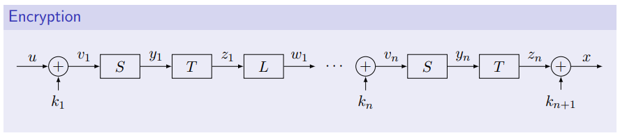

# Answers to the questions of Lecture 06 - Block Ciphers

## 1. What is a Block Cipher?
A block cipher is an encryption system in which both the plaintext and the ciphertext have fixed length
$$
\mathcal{M}=\mathcal{A}_ {u}^{\ell_u} 
$$
$$
\mathcal{X}=\mathcal{A}_ {x}^{\ell_x} 
$$
Also the key has its own length:
$$
\mathcal{K}=\mathcal{A}_ {k}^{\ell_k} 
$$
e.g. Transposition ciphers, linear ciphers.

## 2. Make an example of "Good" and "Bad" concatenation of ciphers.
`Bad:`
- Concatenate many substitution/transposition/linear encryption functions does not increase security [why?](https://en.wikipedia.org/wiki/Linear_map)

`Good:`
- Alternate substitution/transposition/linear encryption functions

## 3. Talk about AES
AES (Advanced Encryption Standard) is a STL iterated cipher with number of round equal to $10$, $12$ or $14$.

$$
\mathcal{M}=\mathcal{X}=\mathcal{K'}=(GF(2^8))^{16}
$$

The Key space is $\mathcal{K}=\mathbb{F}_2^{\ell_k}$, with $\ell_k=16,24,32$.

The encryption schema is:
- AddRoundKey
- Substitution
- Transposition
- Linear transformation

The schema is the following:

- $S$ is based on the inverse of $v$ in $\mathbb{F}$.
- $T$ is cyclic shifting of the elements of $y_i$ when writing it in a $4\times 4$ matrix.
- $L$ is a linear convolution of the elemts of the $4\times 4$ matrix.

## 4. What is a Feistel Cipher?
A Feistel Cipher is a binary block cipher with $\mathcal{M}=\mathcal{X}=\mathbb{B}^{2\ell}$, that works as follows:

1. Split the plain text into 2 blocks of length $\ell$
2. At each round $i$ apply:
    - Substitution (it involves the round keys $k_i$)
    - Linear transformation
    - Transposition
3. Concatenate the two blocks and get the ciphertext

For the deciphering phase, invert the round keys and perform the same steps.

### DES
- Feistel cipher with some vulnerabilities (only 56 bits of the keys are linearlly independent)
- No more used

## 5. Explain the block encryption techniques of long messages
### Electronic Codebook mode (ECB)
`Ciphering`

1. Split into blocks of length $\ell_{u}$
2. Encrypt with an encryption function each blocks
3. Pad ciphertexts and send

`Deciphering`

1. Split into blocks of length $\ell_{u}$
2. Decrypt with a dencryption function each blocks
3. Pad the plaintexts and read

### Cipher Block Chaining mode (CBC)
`Ciphering`

1. Choose an initialization vector
2. xor the splitted plaintext
3. Encrypt with an encryption function and save for next round xor (delay block)
4. Pad all ciphertexts

`Deciphering`

1. split each blocks
2. save delay block
3. Decrypt block
4. xor with delay block
5. pad and read

### Cipher Feedback mode (CFB)
`Ciphering`
1. split
2. xor with encrypted block delay
3. delay block update
4. pad ciphertexts

`Deciphering`
1. split and get delay block
2. xor with encrypted block delay
3. delay block update
4. pad and read

### Output Feedback mode (OFB)
`Ciphering`
1. split
2. encrypt delay block
3. xor with encrypted delay block
4. encrypt delay block feedback
5. pad ciphertexts

`Deciphering`
1. same procedure as ciphering

### Counter mode (CTR)
`Ciphering`
1. choose a random initialization vector
2. split
3. encrypt initialization vector
4. xor with encrypted initialization vector
5. get new initialization vector $n_0+n$
6. pad ciphertexts

`Deciphering`
1. same procedure as ciphering

## [Go back to the main page](../Possible_Questions.md)