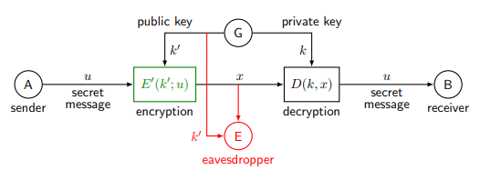
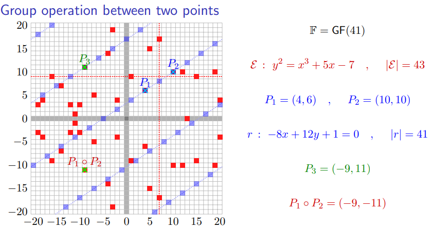
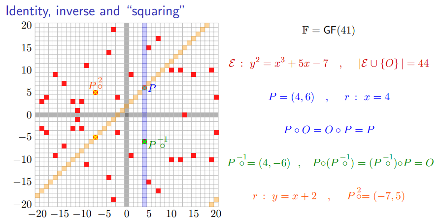

# Answers to the questions of Lecture 08 - Asymmetric Encryption
## 1. Why do we need asymmetric encryption?
Optimization purpuses basically. Supose a user $U$ wants to communicate with $n$ different user. If they use `symmetric encryption`, user $U$ needs $n$ different keys to preserve the confidentiality of the messagges exchanged with the users.

If they use `asymmetric encryption`, to chat with the other users he just need a public key.

With the same encryption sistem $S$ tuple defined in [Lecture_04.md](../Lecture_04/Lecture_04.md):
$$
k\in\mathcal{K} \ \text{private key space}
$$
$$
k'\in\mathcal{K'} \ \text{public key space}
$$
Usually the keys are uniform but not independet, usually the secret key $k$ is selected randomly and uniformally, while $k'=f(k)$.

## 2. Where does secrecy come from in public key encryption?
Secrecy comes from the following statements:
- It is hard to derive $k$ from $k'$.
- It is hard to derive $u$ from $(k',x)$.
- It is hard to derive $k$ from $(u,x)$.

## 3. State the definition of one-way function.
A function $f:\mathcal{X}\rightarrow\mathcal{Y}$ is a $(\varepsilon_0,T_0;\varepsilon_1, T_1)$-one-way function if:
- $f$ is easy to compute (there exist a probabilistic algorithm that computes $f$ in less than $T_1$ time with probability at least $1-\varepsilon_1$).
- $f$ is hard to invert (there exist a probabilistic algorithm that inverts $f$ in less than $T_0$ time with probability at most $\varepsilon_0$).

## 4. RSA cryptosystem.
`Key generation`
- Choose two large primes $p$ and $q$.
- Compute $n=pq$ and $\phi(n)=(p-1)(q-1)$.
- Choose $e$ such that $1<e<\phi(n)$ and $gcd(e,\phi(n))=1$.
- Compute $d$ such that $ed\equiv 1\mod\phi(n)$.

<mark>Private key:</mark> $k=(p,q,d)$.

<mark>Public key:</mark> $k'=(n,e)$.

`Encryption`
- Given a message $u\in\mathcal{M}$, compute $x=u^e\mod n$.

`Decryption`
- Given a ciphertext $x\in\mathcal{X}$, compute $u=x^d\mod n$.

`CORRECTNESS`

$$
\hat{u}=x^d=(u^e)^d=u^{ed}=u^{r\phi(n)+1}=u\cdot u^{r\phi(n)}=u\cdot 1=u\mod n
$$
by the Euler theorem.

## 5. El-Gamal cryptosystem.
`Key generation`
- Choose a generator $\alpha$ of a group $\mathbb{G}

<mark>Private key:</mark> $k$ randomly generated by B.

<mark>Public key:</mark> $k'= \alpha^{k}$ computed by B.

`Encryption`

A chooses a random $b\in\mathbb{G}$.
$$
x = (x_1,x_2) = (\alpha^b,u\cdot(k'^{b}))
$$

`Decryption`

B does not need to know $b$ to decrypt the message.
$$
\hat{u}=x_2\cdot((x_1^{k})^{-1})
$$

`CORRECTNESS`

$$
\begin{align*}
\hat{u} &= x_2\cdot((x_1^{k})^{-1})\\
&= u\cdot(k'^{b})\cdot((\alpha^b)^{k})^{-1}\\
&= u\cdot(\alpha^{k})^{b}\cdot(\alpha^{bk})^{-1}\\
&= u\cdot\alpha^{bk}\cdot\alpha^{-bk}\\
&= u
\end{align*}
$$

## 6. Elliptic Curve Cryptography.
Given a Finite Field $\mathbb{F}$, an Elliptic Curve is defined as the set of points in \mathbb{F}^2 that satisfy the following equation:
$$
y^2=x^3+ax+b
$$
with $a,b\in\mathbb{F}$.

The finite log problem in the Elliptic Curve set is harder than in $\mathbb{Z}_p^*$.

`Point addition example`

`Inverse point example`

## 7. McEliece cryptosystem.
`Key generation`

- B chooses G canonical generator matrix of a Goppa code $(n,\ell,t)$.
- B generates S non singular matrix.
- B generates P permutation matrix.
- B computes $S^{-1},P^{-1}$ and $G'=P^{-1}GS^{-1}$.

<mark>Private key:</mark> $k=(G,S,P)$.

<mark>Public key:</mark> $k'=(G',t)$.

`Encryption`

Generates random error vector $e\in\mathbb{B}^n$ with $w_H(e)\leq t$.

$$
x = u\cdot G' + e
$$

`Decryption`

- B computes $x'=Px$.
- B solves the mHd decoding of $x'$ in the Goppa code with canonical $G$
$$
u' = \arg\min_{\beta\in\mathbb{B}^\ell}d_H(x',G\beta)
$$
- B computes $\hat{u}=u'S$.

## [Go back to the main page](../Possible_Questions.md)