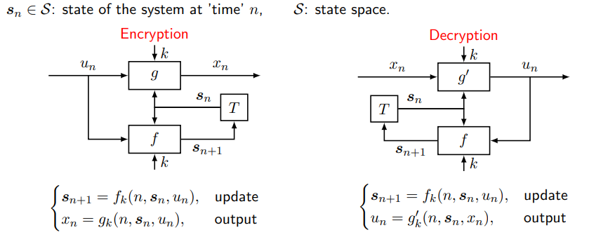
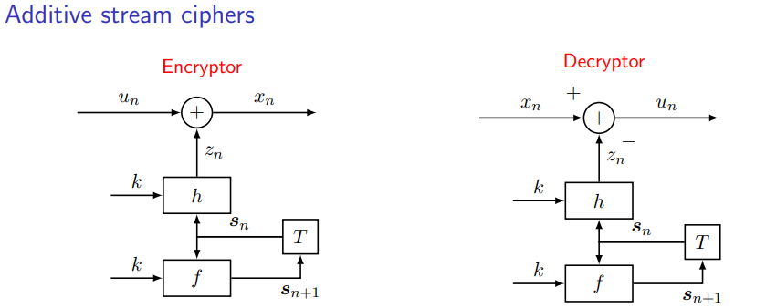
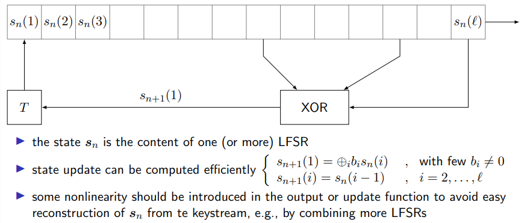

# Answers to the questions of Lecture 09 - Stream Ciphers

## 1. General Model of a Stream Cipher.
The general model of a stream cipher is the following:

The receiver must know $(k,s_0)$. The sender and the receiver must agree on the same $k$ and $s_0$.

In general Additive Stream Ciphers follow the following model:

Generally Additive Stream Ciphers are not secure due to keystream reuse.
With KPA: two messages $m_1$ and $m_2$ are encrypted with the same keystream $s_n$. Then $c_1 = m_1 \oplus s_n$ and $c_2 = m_2 \oplus s_n$. Then:
$$
m_2 = c_2 - s_n = c_2 - c_1 + m_1
$$
This is a very powerful attack. The attacker can recover the plaintext of $m_2$ without knowing the key if he knows the plaintext of $m_1$ and the ciphertexts of $c_1$ and $c_2$.
## 2. Rivest Cipher 4 and Linear Feedback Shift Registers.

### Rivest Cipher 4
Example of a stream cipher is the Rivest Cipher 4 (RC4). It is an example of additive stream cipher.

It was used in WEP (Wired Equivalent Privacy) protocol for wireless networks. It is not secure because it is vulnerable to keystream reuse.

### Linear Feedback Shift Registers
A Linear Feedback Shift Register is a shift register whose input bit is a linear function of its previous state. The following figure shows a LFSR with $n$ bits:

Example of LFSR is GSM A5/1. 

`Specific vulnerabilities`

- State update is not one-to-one. 
- 64-bit state space is too small.

`Attacks`
- Biased birthday state guessing attack.

## [Go back to the main page](../Possible_Questions.md)