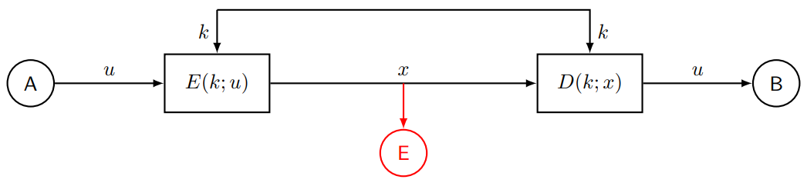
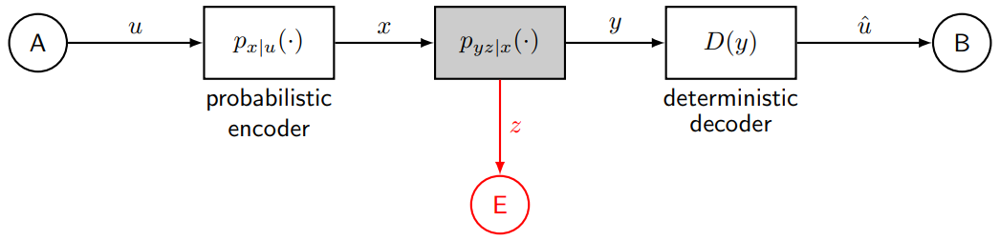
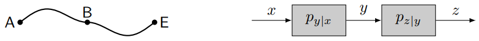
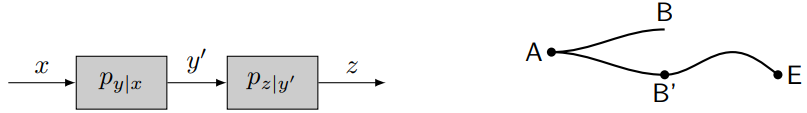

# Answers to the questions of Lecture 10 - Physical Layer Secrecy

## 1. What is the motivation for Physical Layer Secrecy?

Wireless communication are vulnerable to various attacks:
- Eavesdropping
- Jamming

Cryptographic solutions require costly key renewal.

Physical Layer Security achieves the `goal` of confidentiality against the `threat` of eavesdropping through the service of `secrecy` by using the `mechanism` of wiretap channels.

## 2. Unconditional secrecy vs Wiretap channel model.

`Unconditional secrecy with noiseless channels`

Secrecy is based on hiding the $k$.

`Wiretap channel model`

Reliability is measured by the error probability.
Secrecy is measured by the Mutual Information between $u$ and $z$.

For perfect secrecy and reliability, see the LAB 2 of the RoC path in the [Github repo](https://github.com/Kekkodf/RoC-Path-Information-Security).

## 3. Which is the ordering of degraded channels?

- Channel A$\to$E is `physically degraded` with respect to channel A$\to$B if $z$ is independent of $x$ given $y$.

- Channel A$\to$E is `stochastically degraded` with respect to channel A$\to$B if $z$ is independent of $x$ given some other $y'$, with $p_{y'|x}=p_{y|x}$.

- Channel A$\to$E is `more noisy` than channel A$\to$B if for any precoder $u\to x$ with $u$ independent from $(y,z)$ given $x$, we have $I(u;y)>I(u;z)$.

- Channel A$\to$E is `less capable` than channel A$\to$B if for any $x$ we have $I(x;y)>I(x;z)$.

Ex.

Binary Symmetric Channel (BSC) and Additive White Gaussian Noise (AWGN) channel.
## [Go back to the main page](../Possible_Questions.md)