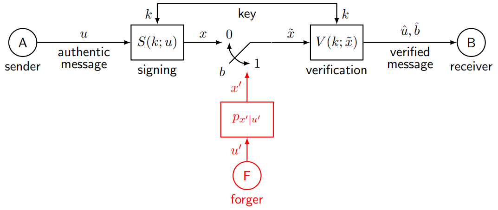
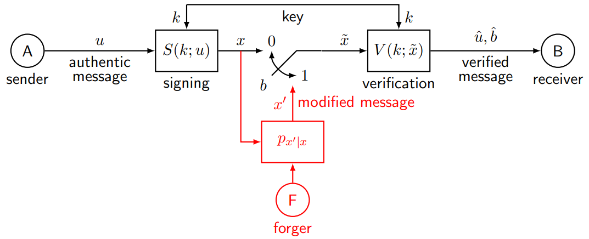
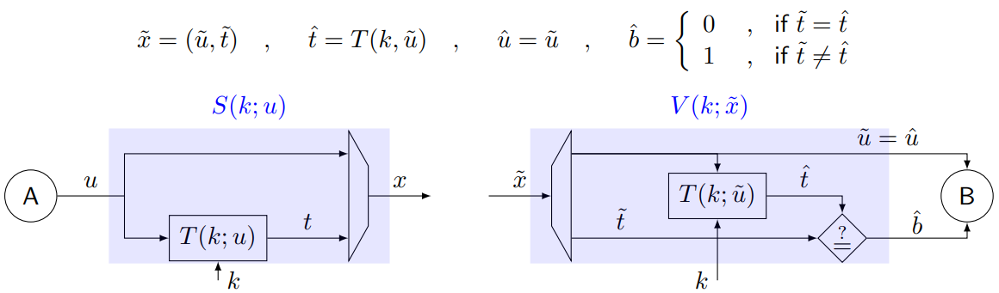

# Answers to the questions of Lecture 11 - Authentication and Integrity Protection

## 1. Goals, Threats, Services and Mechanisms in Authentication and Integrity Protection

The goals of Authentication and Integrity Protection are:
- Integrity
- Accountability

The threats are:
- Forgery
- Masquerade

Services:
- Integrity Protection
- Authentication

Mechanisms:
- Message Authentication Codes (MACs)

The general model of teh authentication Problem is:

F wants to build $x'$ so that $\hat{u}=u'$ and $\hat{b}=0$.

The general model of the integrity protection problem is:

F can block $x$ and wants to replace it with $x'$ so that $\hat{u}\neq u$ and $\hat{b}=0$.

A tipical solution for signing is to append a tag to the message
$$
x=(u,t),\ \ \ t=T(k,u)
$$
where $T$ is a tag generation algorithm.

One Time Pad does NOT provide integrity protection since one attacker can simply block $(u,t)$, replace $u$ with $u'$ and send $(u',t)$ which will be accepted by the receiver.

## 2. State the three properties of a Universal Hash Function

For unconditional secure A+IP we take $\{T_k(\cdot)\}_{k\in\mathcal{K}}$ to be a $\varepsilon$-almost strongly universal family of hash functions for some $\varepsilon\in(0,1)$ if

- `Uniform mapping`
  $$
  \left|\mathcal{K}_{u\to t}\right|\leq\varepsilon\left|\mathcal{K}\right|
  $$
  where $\mathcal{K}_{u\to t}=\{k\in\mathcal{K}:T_k(u)=t\}$

- `Uniform collision`
  $$
  \left|\mathcal{K}_{u_1u_2}\right|\leq\varepsilon\left|\mathcal{K}\right|
  $$
  where $\mathcal{K}_{u_1u_2}=\{k\in\mathcal{K}:T_k(u_1)=T_k(u_2)\}$

- `Uniform pairwise mapping`
  $$
  \left|\mathcal{K}_{u_1\to t_1}\cap\mathcal{K}_{u_2\to t_2}\right|\leq\varepsilon\left|\mathcal{K_{u_1\to t_1}}\right|
  $$
  for all $u_1\neq u_2$ and $t_1,t_2\in\mathcal{T}$

The lowest possible value for $\varepsilon$ is $\frac{1}{\left|\mathcal{T}\right|}$.

## 3. Theorem of Unconditional security of universal hash functions

If the family of tag computation functions $\{T_k\}$ is $\varepsilon$-almost strongly universal for some $\varepsilon$ > 0,
and the key is chosen uniformly, the A+IP mechanism is $\varepsilon$-unconditionally secure. 

<mark>Proof.</mark>

Since the correctness is provided by tag appending, we just need to prove that the success probability for forging and modification attacks is bounded by $\varepsilon$.

`Forging/Modification attack`

$$
\begin{align*}
    P[S_f] &= P[\hat{b}=0]\\
    &= P[t'=T_k(u')] \\
    &= \sum_{a,b}P[t'=T_k(u')|u'=a,t'=b]p_{u',t'}(a,b) \\
    &= \sum_{a,b}P[b=T_k(a)|u'=a,t'=b]p_{u',t'}(a,b) \\
    &= \sum_{a,b}P[k\in \mathcal{K}_{a\to b}|u'=a,t'=b]p_{u',t'}(a,b) \\
    &= \sum_{a,b}\frac{\left|\mathcal{K}_{a\to b}\right|}{\left|\mathcal{K}\right|}p_{u',t'}(a,b) \\
    &\leq \sum_{a,b}\varepsilon p_{u',t'}(a,b) \\
    &= \varepsilon 
\end{align*} 
$$
It holds for any strategy $p_{u',t'}$.

## [Go back to the main page](../Possible_Questions.md)