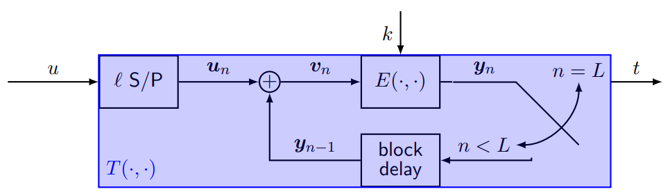
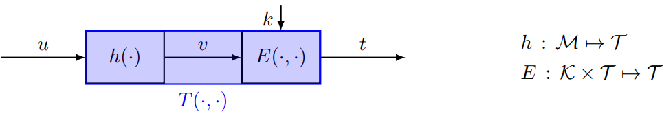

# Answers to the questions of Lecture 12-13 - Symmetric Authentication and Integrity Protection
## 1. What are MACs?
A Message authentication code (MAC) is a symmetric mechanism providing authentication and integrity protection of the tag-appending kind that offers computational security.
It must be hard for the attacker to find $t$, given $u$ but not $k$ even under:
- Known message attack (KMA)
- Chosen message attack (CMA)

## 2. Can we use a well designed Decryption function as a Tag function?
No. There is a difference.

- in decryption, $|\mathcal{X}|\geq|\mathcal{M}|$ because each encryption is injective.
- in MACs. the entropy $H(t)$ and $|\mathcal{T}$ are dictated by the target security level, and nearly independent of $H(u)$ and $|\mathcal{M}|$.

Two solutions:
- CBC-MAC
- Hash and Sign

## 3. Which are the differences between CBC-MAC and Cryptographic Hash Functions?

`CBC-MAC`

The security of CBC-MAC is based on:
- if E is secure and \mathcal{M} is prefix-free, the CBC-MAC is secure.
- if E is secure and \mathcal{M} is not prefix-free, the CBC-MAC is vulnerable to the deterministic KMA attack.

`Cryptographic Hash Functions`

A Hash fnction is charachterized by:
- computability: it is easy to compute $h(m)$ for any $m\in\mathcal{M}$.
- uniform output: given an arbitary distribution $p_x$ for $x$, it should be $y\sim \mathcal{U}(\mathcal{Y})$.

The three properties of a hash function are:
- `preimage resistance:` given $y_0$ it is hard to find $x_0$ such that $h(x_0)=y_0$.
- `weak collision:` given $x_0$ it is hard to find $x_1\neq x_0$ such that $h(x_0)=h(x_1)$.
- `collision resistance:` it is hard to find any pair $x_0\neq x_1$ such that $h(x_0)=h(x_1)$.

## 4. Why is cryptographic hashing needed?
- if $h$ is not a weak collision resistant hash function, the system is vulnerable to the modification attack. F intercepts $(x,t)$, finds a $u'$ colliding with $u$, so $h(u')=h(u)$, and sends $(u',t)$. The receiver accepts the message.

- if $h$ is not a strong collision resistant hash function, the system is vulnerable to the forging attack. F finds a colliding pair $(u,u')$, lures A into signing $(u,t)$, and then replaces $u$ with $u'$. The receiver accepts the message.

## 5. What is the birthday paradox?
The birthday paradox is a phenomenon in probability theory that, in a random group of 23 people, there is a 50% chance that two people have the same birthday.

Basically it says that if we have $n$ people, the probability that two of them have the same birthday is:
$$
p(n)=1-\frac{365!}{(365-n)!365^n}
$$
If we want to have a probability of $p(n)=0.5$ we need $n=23$.

## [Go back to the main page](../Possible_Questions.md)