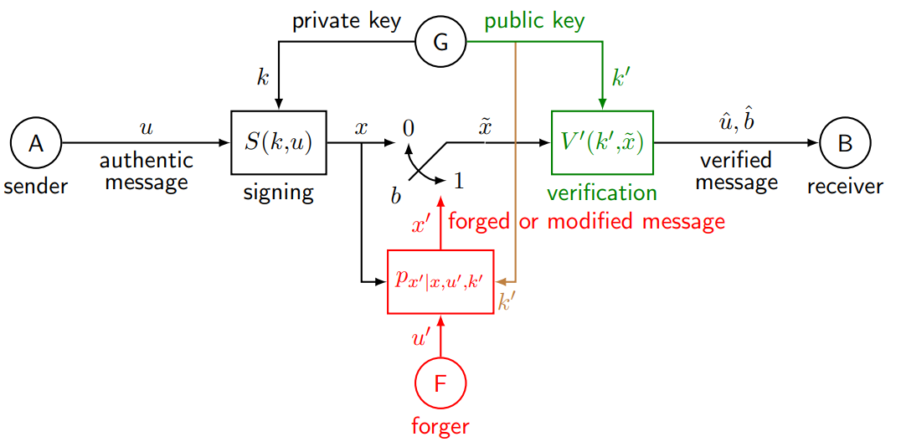
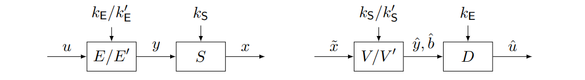
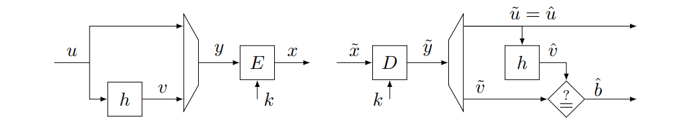
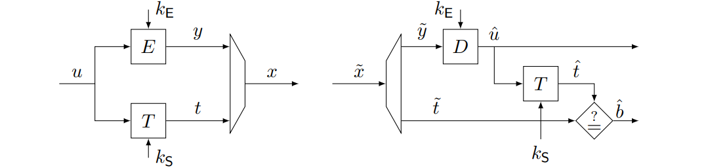

# Answers to the questions of Lecture 14 - Digital Signatures

## 1. Which are the Goals, Threats, Services and Mechanisms in Digital Signatures?
`Goals`
- Integrity
- Accountability

`Threats`
- Forgery
- Masquerade
- Repudiation

`Services`
- Integrity Protection
- Authentication
- Notarization

`Mechanisms`
- Digital Signatures

The general model is shown in the figure below:

The tag appending solution has two drawbacks:
- it only authenticates fixed length messages
- it is vulnerabale to existential forgery

Both problem can be solved by using Cryptographic Hash Functions.

## 2. Explain the RSA Digital Signature Scheme
Let $h$ be an hashing function, $h:\mathcal{M}\rightarrow\mathcal{V}$, where $\mathcal{M}$ is the set of messages and $\mathcal{V}$ is the set of values. The RSA Digital Signature Scheme is defined as follows:

- Key Generation: $(p,q,d)$ private key, $(n,e)$ public key

`Signing`

$$ t = h(m) = v^d \mod n$$

`Verification`

$$ v = t^e \mod n$$

Note that only the sender can sign the message, because only the sender knows the private key $d$. Everyone can verify the signature, because everyone knows the public key $e$.

## 3. Explain the Elgamal Digital Signature Scheme
Let $p$ be a prime and $\alpha$ a generator of $\mathbb{Z}_p^*$, the Elgamal Digital Signature Scheme is defined as follows:

- Key Generation: random uniform $k\in\mathcal{K}$ is the private key, $k'=\alpha^k$ is the public key.

`Signing`

A generates $r$ with $\gcd(r,p-1)=1$ and computes $t$ as follows:
$$
  \begin{cases}
    t_1 = \alpha^r \mod p\\
    t_2 = (h(m)-kt_1)r^{-1} \mod (p-1)
  \end{cases}
$$

`Verification`

B do not need to know $r$. The message is accepted if 
$$
k'^{t_1}t_1^{t_2}=\alpha^{h(m)} \mod p
$$

## 4. Explain the Elliptic Curve Digital Signature Scheme
Let the private space $\mathcal{K}$ of cardinality $k$ and the public space $\mathcal{K'}=\mathcal{E}$. The Elliptic Curve Digital Signature Scheme is defined as follows:
- Key Generation: A randomly generates $k$ and computes $k'=P\cdot^k$

`Signing`

A generates $r$, and computes t as follows ($c_1$ is the $x$ coordinate of $Q\in\mathcal{E}$):
$$
  \begin{cases}
    t_1=c_1(P\cdot^r)\mod q\\
    t_2=r^{-1}(h(m)+t_1k)\mod q
  \end{cases}
$$

`Verification`

B computes 
$$
  \begin{cases}
    m = t_2^{-1}h(m)\mod q\\
    n = t_2^{-1}t_1\mod q\\
    Q = P\cdot^m\cdot k'\cdot^n
  \end{cases}
$$
The message is accepted if $c_1(Q)=t_1$.

## 5. How to combine different Digital Signature Schemes?

### Sign then Encrypt
Used in TLS. First sign the message, then encrypt the signed message.
- Needs two distinct keys

### Encrypt then Sign
Used in ESP and IPsec. First encrypt the message, then sign the encrypted message.
- Needs two distinct keys

### Hash then Encrypt
Used in WEP (BIG FAIL). First hash the message, then encrypt the hashed message.
- Needs only one key

### Sign and Encrypt

Compute the authentication tag over the plaintext and then append the tag to the ciphertext.
- Needs two distinct keys

## [Go back to the main page](../Possible_Questions.md)