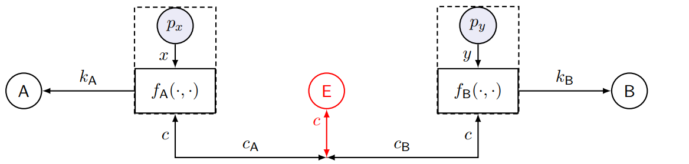
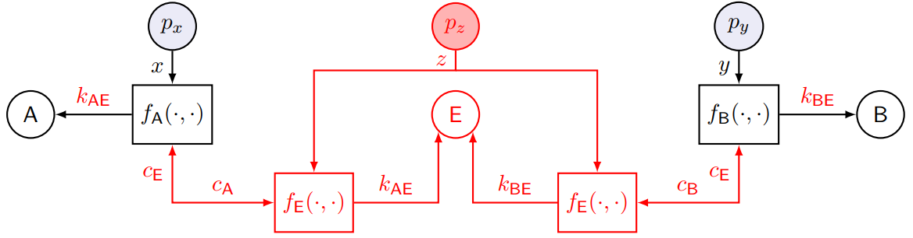
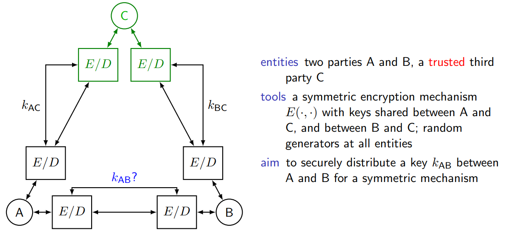
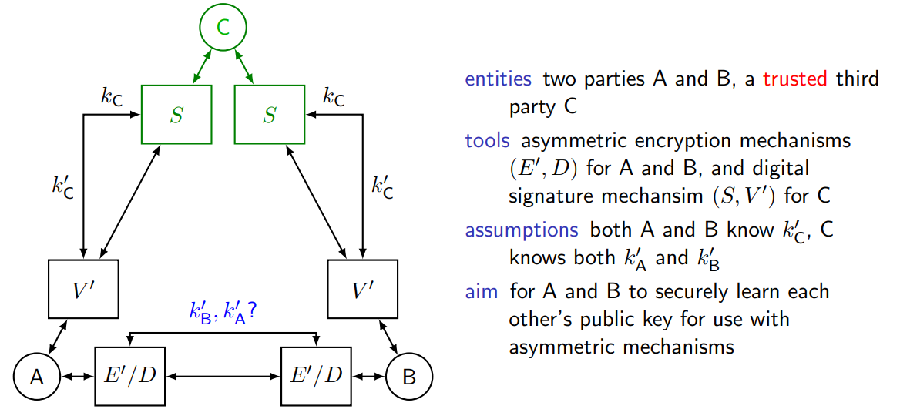

# Answers to the questions of Lecture 15 - Key Management Services
## 1. Which are the Goals, Threats, Services and Mechanisms in Key Management?

`Goals`
- Confidentiality
- Integrity
- Accountability

`Threats`
- Eavesdropping
- Forgery
- Masquerade

`Services`
- Secrecy
- Integrity Protection
- Authentication

`Mechanisms`
- Key Agreement

The Key management services are:
- Key generation
- Key distribution
- Key storage
- Key recovery
- Key renewal
- Revocation of captured keys
- Destruction of untrusted keys

## 2. How does the Diffie Hellman Key Agreement work?

The Diffie Hellman Key Agreement is a key agreement protocol that allows two parties to agree on a shared secret over an insecure channel. The protocol is based on the discrete logarithm problem. The protocol is as follows:

1. Alice and Bob agree on a large prime number `p` and a generator `g` of the multiplicative group of integers modulo `p`.
2. Alice chooses a $k_A \sim \mathcal{U}(\mathbb{Z}_p^*)$ and sends $g^{k_A} \mod p$ to Bob.
3. Bob chooses a $k_B \sim \mathcal{U}(\mathbb{Z}_p^*)$ and sends $g^{k_B} \mod p$ to Alice.
4. They both have:
$$
f_A:
\begin{cases}
c_A=g\cdot^x\\
k_A=c_B\cdot^x
\end{cases}
$$
$$
f_B:
\begin{cases}
c_B=g\cdot^y\\
k_B=c_A\cdot^y
\end{cases}
$$
where $x,y$ i.i.d. and uniform in $\mathbb{Z}_p^*$.

Problems:
- Man-in-the-middle attack

Solution:
- The messages $c_A,c_B$ must be autheticated and integrity protected, use digital signature.

## 3. How does the Needham-Schroeder symmetric key protocol work?

The general schema is the following:

The protocol is as follows:

`Key distribution`

1. A generates a nonce $n_A$ and sends $(id_A,id_B,n_A)$ to C
2. C generates $k_{AB}$, encrypts $x_2=E_{k_{BC}}(id_A, k_{AB})$ and $x_3=E_{k_{AC}}(N_A,id_B,k_AB,x_2)$ and sends $x_3$ to A
3. A decrypts x_3 and checks the nonce and id_B, then sends $x_2$ to B
4. B decrypts $x_2$ and checks the id_A.

`Key confirmation`

1. B generates a nonce $r_B$ and encrypts it with $k_{AB}$ and sends $E_{k_{AB}}(r_B)$ to A
2. A decrypts $E_{k_{AB}}(r_B)$ and sends $E_{k_{AB}}(r_B-1)$ to B
3. B decrypts and checks $r_A=r_B-1$

Vulnerability: Denning-Sacco attack based on the replay of the protocol using an old key $K_{AB}$ and the respective recorded session.

Solution: Otway-Rees protocol

Use an initial nonce $n_B$ which is verified by C at the beginning of the protocol, then continue with the Needham-Schroeder protocol.

Example of the Needham-Schroeder protocol:
- Kerberos (double symmetric key protocol with timestamps)

## 4. How does the Needham-Schroeder asymmetric key protocol work?
The general schema is the following:

The protocol is as follows:

`Key distribution`

1. A sends $(id_A,id_B)$ to C
2. C signs the message with its private key and sends $x_2=S_{k_{C}}(id_A,k'B)$ to A
3. A verifies the signature and generates a nonce $r_A$ and sends $x_3=E_{k_{k'B}}(r_A,id_A)$ to B
4. B decrypts and send $u_4=(id_A,id_B)$ to C
5. C signs the message with its private key and sends $x_5=S_{k_{C}}(id_A,k_A')$ to B
6. B verifies the signature.

`Key confirmation`

1. B generates a nonce $r_B$ and encrypts it with $k'_A$ and sends $E_{k'_A}(r_A,r_B)$ to A
2. A decrypts $E_{k'_A}(r_A,r_B)$, verifies $r_A$ and sends $E_{k'_B}(r_B)$ to B
3. B decrypts and checks $r_B$

Vulnerability: Lowe attack based on a malicious B that:
- use an authetic exchange initiated by A
- impersonates A in an exchange with D
- rencrypts the 3. for D and use A as oracle

Solution: Include $id_B$ in KC 1. and KC 2.

## 5. Why the need for PKIs?
A Public Key Infrasrttructure (PKI) defines protocols, polices and mechanisms needed to guarantee the authentication of public keys. 

Certificates are signed messages by a third party C that binds a public key to an identity. 

## [Go back to the main page](../Possible_Questions.md)