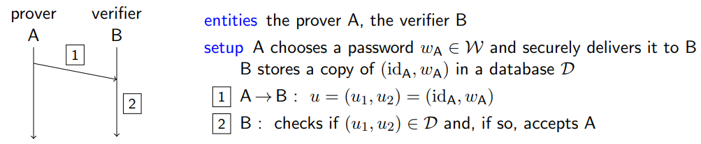
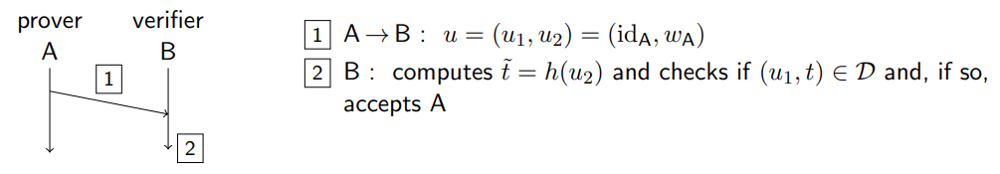
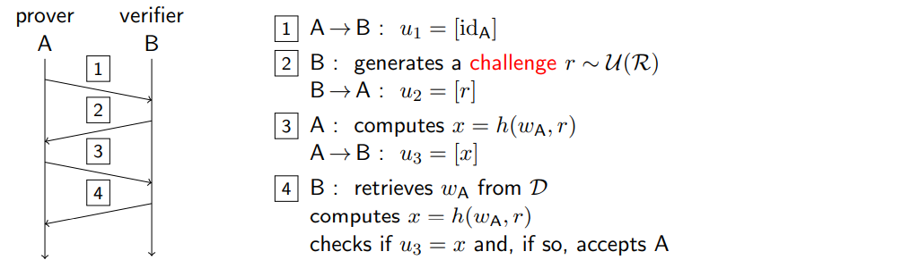
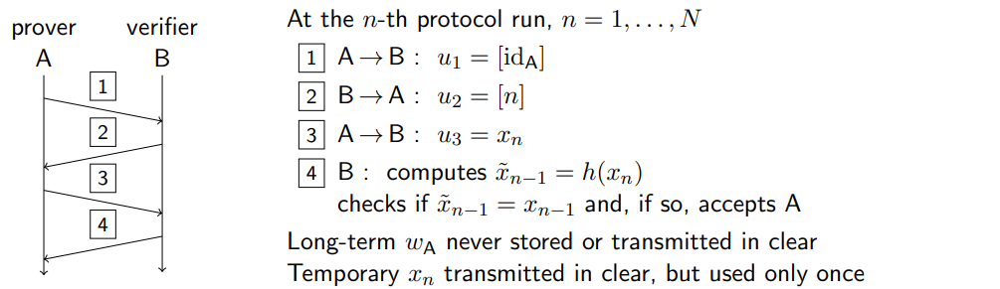
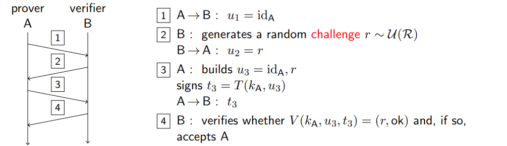
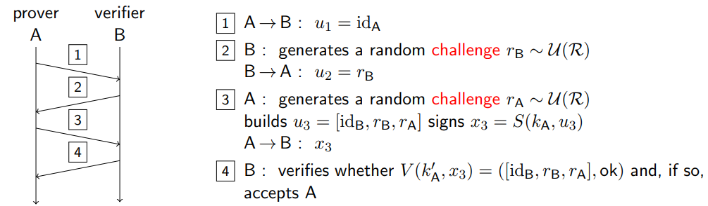
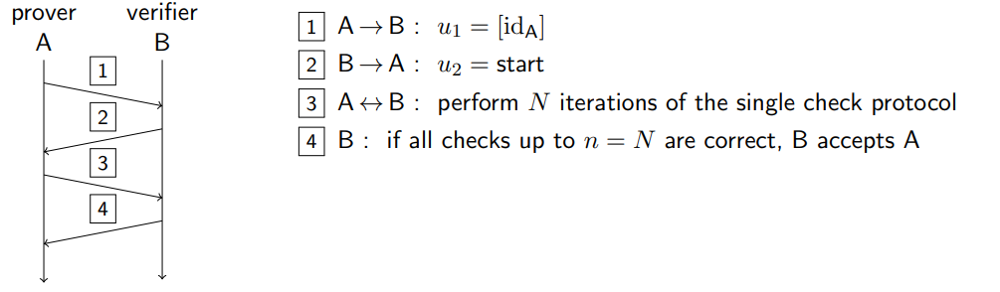

# Answers to the questions of Lecture 18 - Entity Authentication Protocols

## 1. Which is the general model for Entity Authentication Protocols?
An entity A wants to prove its identity to an entity B through an interactive protocol. At the end of the protocol, B should be convinced that A is indeed the entity it claims to be.

`Requirements`

- Correctness: B should be convinced that A is indeed the entity it claims to be
- Security: F should not be able to convince B that it is A
- Non transferability: B should not be able to convince another entity C that A is indeed the entity it claims to be

`Threaths`

- Masquerade: An entity F claims to be another entity B

F can:
- forge new messages
- modify messages
- divert the transit of messages and analyze them

## 2. Which are the two types of Entity Authentication Protocols?

- Password based
- Cryptographic authentication

`Password based`

- Something only A possesses (token, smart card, etc.)
- Something only A is (biometrics)
- Something only A knows (password)

The general model is:

Weaknesses:
- B learns A's password
- the password is transmitted in the clear
- the password is stored in the clear

Possible solution:
- hash based password authentication (tool: hash function)

Problems:
- password is still transmitted in the clear
- dictionaries attacks are possible

Solution:
- Use salt for hashing

`Cryptographic based`

Challenge handshake authentication protocol (CHAP)

One time password (OTP) - Vulnerable to MITM attacks

Challenge-response with symmetric A+IP

Challenge-response with asymmetric A+IP

Zero-Knowledge Proof (ZKP) - Vulnerable to Chess-Master attacks

Basically the prover proves to the verifier that it knows a secret without revealing the secret itself. The prover can prove to the verifier that it knows the secret by using a challenge-response protocol.

## [Go back to the main page](../Possible_Questions.md)