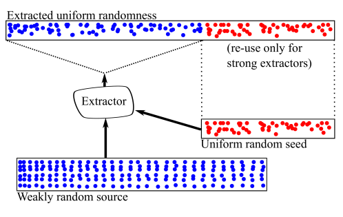
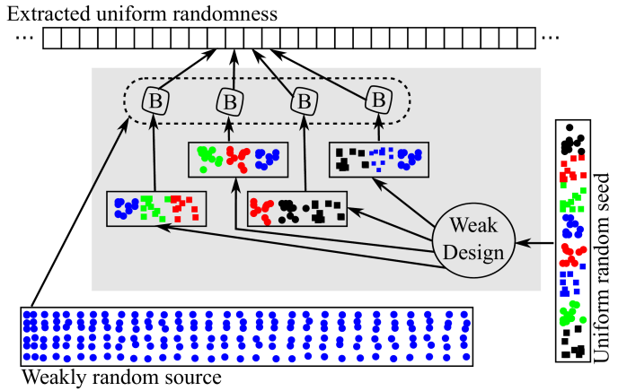

# Answers to the questions of Lecture 19 - Secure Random Number Generation

## 1. What is the motivation for Secure Random Number Generation?

- Key generation
- Secrets for key agreement
- Nonces in interactive protocols
- Randomized algorithms
- Probabilistic mechanisms

## 2. What is the difference between a Pseudo Random Number Generator and a True Random Number Generator?

`Secure PRNG` is a PRNG that is compuatationally indistinguishable from a TRNG by any efficient adversary.

`True Random Number Generator` is unconditionally indistinguishable from a truly random source by any efficient adversary.

## 3. Cryptographic Secure PRNGs
- Blum Blum Shub

Let $p$ and $q$ be two large primes such that $p \equiv q \equiv 3 \mod 4$. Let $N = pq$ and $s_0$ be a seed.
$$
\begin{cases}
s_{n+1}=s^2_n\mod N\\
z_n = s_n \mod 2
\end{cases}
$$

- RSA PRNG
  
Let $N = pq$ be an RSA modulus and $e$ be the public exponent. Let $s_0$ be a seed.
$$
\begin{cases}
s_{n+1}=s^e_n\mod N\\
z_n = s_n \mod 2
\end{cases}
$$

- Hash function PRNG

Let $h$ be a cryptographic hash function. Let $s_0$ be a seed.
$$
\begin{cases}
s_{n+1}=s_n+1\\
z_n = h(s_n)
\end{cases}
$$

- Symmetric Encryption PRNG

Let $E$ be a secure symmetric encryption scheme with secret key $k$. Let $s_0$ be a seed.
$$
\begin{cases}
s_{n+1}=s_n+1\\
z_n = E(k, s_n)
\end{cases}
$$

- HMAC PRNG

Let $h$ be a cryptographic hash function. Let $s_0$ be a seed.

$$
\begin{cases}
s_{n+1}=T(k,s_n)\\
z_n = s_n
\end{cases}
$$

- Elliptic Curve PRNG
  
Let $\mathcal{E}$ be an elliptic curve over $\mathbb{F}_p$ and $P,Q$ be two points on $\mathcal{E}$ with coordinates $c_1(P), c_2(P), c_1(Q), c_2(Q)$. A random output of $r$ bits is generated as follows:
$$
\begin{cases}
y_n = c_1(P\cdot^{s_n})\\
s_{n+1} = c_1(P\cdot^{y_n})\\
z_n = c_1(Q\cdot^{y_n})\mod 2^r
\end{cases}
$$
Vulnerable to the EC DRBG attack, which is a backdoor attack. The attacker can predict the output of the PRNG by knowing $q\in\mathbb{Z_p}$ such that $Q = qP$.

## 4. Deterministic extarctor of randomness.
Deterministic extractors are trasformations mapping long messages with low information efficiency to shorter messages with higher efficiency.

A seeded extractor is a function
$$
f:\mathcal{X}\times\mathcal{V}\rightarrow\mathcal{Z}
$$
such that $\log_2|\mathcal{Z}| \cong H_{min}(x)$ and if $v$ is uniformly distributed, then $d_V(p_z,p_z^*)<<1$.

See Leftover Hash Lemma in the slides.

## 5. What is the Trevisan's extractor?
It's a scheme employing:
- a binary seed of length $\ell$
- a strong 1-bit extractor with seed length $\ell'<\ell$

it's used to build a strong $m$-bit extractor
- each output bit is obtained by combining a different subset of $\ell'$ bits of the seed
- subsets have minimum overlap

## [Go back to the main page](../Possible_Questions.md)