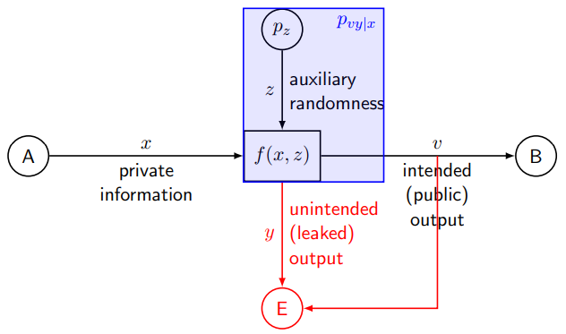
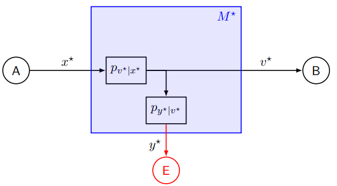
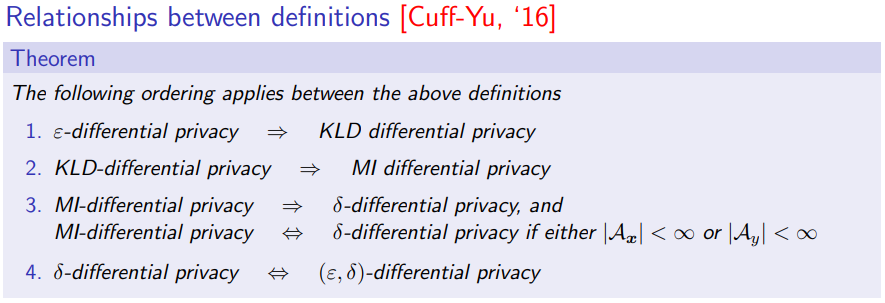

# Answers to the questions of Lecture 20 - Privacy Measures and Mechanisms

## 1. Define Goals, Threats, Services and Mechanisms in Privacy Systems.

Goal: `Privacy`

Threats: `Profiling and Fingerprinting`

Service: `Anonymization`

Mechanism: `Randomization`

The aim of a Privacy system os to prevent an external entity from learning additional information about the private information $x$ beyon what is available from the intended public output $v$.

`General Model`

 

`Ideal Model`

 Ideally $x^*$ and $y^*$ are conditionally independent given $v$.

 ## 2. $k$-Anonymity, $\ell$-Diversity and $t$-Closeness

`k-Anonymity`

A privacy mechanism is said to provide $k$-anonymity for some $k\in\mathbb{N}$
$$
|f^{-1}(b)|\geq k \ \forall b\in\mathcal{A}_{y'}
$$
where $f$ is the mapping from $x$ to $y$ and $\mathcal{A}_{y'}$ is the set of all possible values of $y'$.

If $k$-anonymity is satisfied, then observig $y,v$ still leaves at least with $k$ different possible values of $(x,z)$ (e.g. databases (attributes,value)).

`l-Diversity`

A privacy mechanism is said to provide $\ell$-diversity for some $\ell\in\mathbb{N}$ if
$$
\left|\{a\in\mathcal{A}_x:\exists c, (a,c)\in f^{-1}(b)\}\right|\leq\ell \ \forall b\in\mathcal{A}_{y'}
$$
If $\ell$-diversity is satisfied, then observing $y,v$ still leaves at least with $\ell$ different possible values of $(x)$.

`t-Closeness`

A privacy mechanism is said to provide $t$-closeness for some $t\in(0,1)$ if
$$
d_V(p_{x|y'=b},p_x)=\frac{1}{2}\sum_{a\in\mathcal{A}_x}\left|p_{x|y}(a|b)-p_x(a)\right|\leq t \ \forall b\in\mathcal{A}_{y'}
$$
where $d_V$ is the total variation distance.

## 3. Relationship between definitions of Differential Privacy

### $\varepsilon$-Differential Privacy

An anonymization mechanism is said to provide $\varepsilon$-differential privacy for some $\varepsilon\in\mathbb{R}^+$
$$
P[y\in S|x=a]\leq e^\varepsilon P[y\in S|x=a'] \ \forall S\subset\mathcal{A}_y
$$

### KLD-Differential Privacy
An anonymization mechanism is said to offer KL divergence differential privacy for some $\varepsilon$ > 0 if for all pairs of neighbour values a, a'
$$
D_{KL}(p_{y|x=a}||p_{y|x=a'})\leq\varepsilon
$$

### MI-Differential Privacy
An anonymization mechanism is said to offer mutual information differential privacy for some $\varepsilon$ > 0 if
$$
I(x_n;y|x_1,\dots,x_{n-1},x_{n+1},\dots,x_N)\leq\varepsilon
$$
### $\delta$-Differential Privacy
An anonymization mechanism is said to offer $\delta$-differential privacy for some $\delta>0$
$$
P[y\in S|x=a]\leq P[y\in S|x=a']+\delta \ \forall S\subset\mathcal{A}_y
$$

### $(\varepsilon,\delta)$-Differential Privacy
An anonymization mechanism is said to offer $(\varepsilon,\delta)$-differential privacy for some $\varepsilon,\delta>0$
$$
P[y\in S|x=a]\leq e^\varepsilon P[y\in S|x=a']+\delta \ \forall S\subset\mathcal{A}_y
$$

## [Go back to the main page](../Possible_Questions.md)