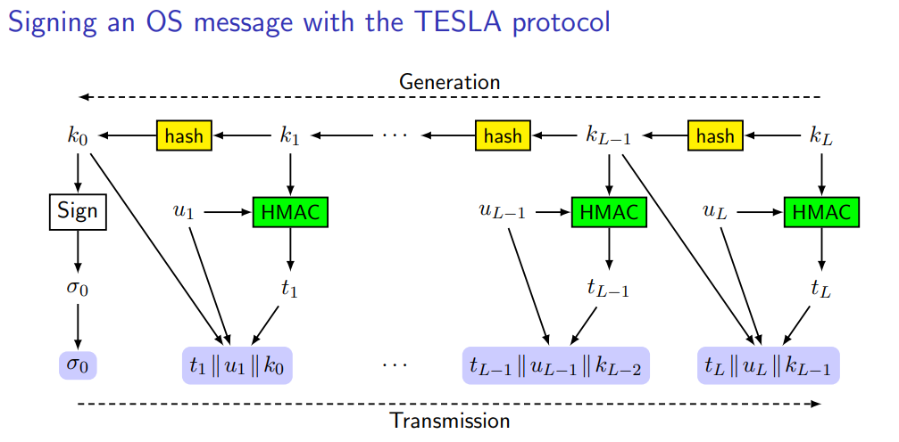
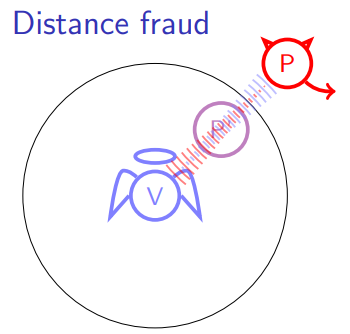
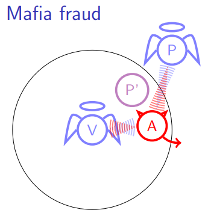
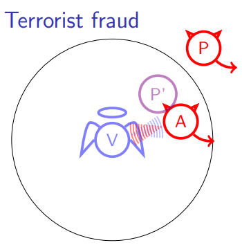

# Answers to the questions of Lecture 21 - Secure Positioning: Secure GNSS and Distance Bounding

## 1. What is GNSS (Global Navigation Satellite System)?
The Global Navigation Satellite System (GNSS) is a satellite-based navigation system that provides location and time information. The inputs used for computing the Position, Velocity and Time are:
- Navigation data, to compute the satellite position
- Distance estimation from the satelites
- Regional corrections from satellite-based augmentation systems

The ranging is the estimation process:
- measuring the signal time of arrival
- correlation with the spreading code
- corrupted by several errors

The main problem in GNSS is the authentication and integrity problem: How can I say if the signal is coming from a satellite or from a spoofed source?

## 2. What is Galileo OSNMA? Why Digital signature is not enough?
Galileo OSNMA is the Open Service Navigation Message Authentication. It combines features of symmetric and asymmetric A+IP.
- each message is signed via MAC with a key $k_i$
- the message tag $(u_i,t_i) are transmitted and the key will be later disclosed after all terminals have received $u_i$ and $t_i$.
- all keys are authenticated via a digital signature of the hash and signtype.
- for convenience, the key is obtained by hashing the next key so they are computed in the reverse order.

The problem is that the digital signature is not enough because it is possible to spoof the real position of the satellite. 

Some attacks are:
- **SCER (Signal Corruption and Effect Replay)**: the attacker corrupts the signal and then replays it later.
- **Jamming**: the attacker sends a signal that is stronger than the real signal.
- **Man-in-the-middle**: the attacker intercepts the signal and then replays it later.

## 3. What is Distance Bounding?
Distance bounding is a cryptographic protocol between a prover and a verifier. 

1. Preliminary phase: share a long-term secret key $k$
2. Initialization phase: share a temporary session key $s=g(k)$
3. Timi vs a distance boundng phase: many challenges and responses are exchanged
4. Verification phase: the verifier checks the responses and the times

`Requirements`

- Very short response process time
- Cryptographic computations only at the beginning

## 4. Differences between Distance fraud, Mafia fraud and Terrorist fraud.

`Scenario`

A dishonest prover P is far from the verifier V

`Aim`

P attempts to convince V that P is close to him

`Attack`

P reduces the response computation time or guesses the challenges in advance

`Countermeasures`

- Bound on computation time
  $$
  \tau_C \leq\frac{d'-d}{c}<<t_{max}
  $$
- The response must depend on the challenge, which must be unpredictable, i.e. uniformally distributed
- The challenge and response waveforms must have short duration

`Scenario`

An honest prover P is far from the verifier V and the attacker A is near V

`Aim`

A attempts to convince V that P is close to V

`Attack`

A intercepts the challenge and the response, forwards the challenge to P and use him as an oracle

`Countermeasures`

- The response must depend on some secret s between P and V
- The shared secret s must be derived from P's credentials
- The shared secret s must be renewd in each session

`Scenario`

A dishonest P is far from the verifier V and a malicious A is close to V

`Aim`

P and A collude and attempt to convince V that P is close to V without P giving his/her long term credentials to A

`Attack`

P shares with A his/her temporary secret, so A can compute the response and answer immediately

`Countermeasures`

- The response must depend on some secret shared s between P and V
- The shared secret s must leak out significant information from P's credentials

<h2 align='center'>Differences</h2>

Basically the first two attacks analyze two different scenarios, the first is an attack carried out by the Prover P, while the latter is an attack carried by a third entity which is an external attacker.
The third attack combines the first two.

## [Go back to the main page](../Possible_Questions.md)