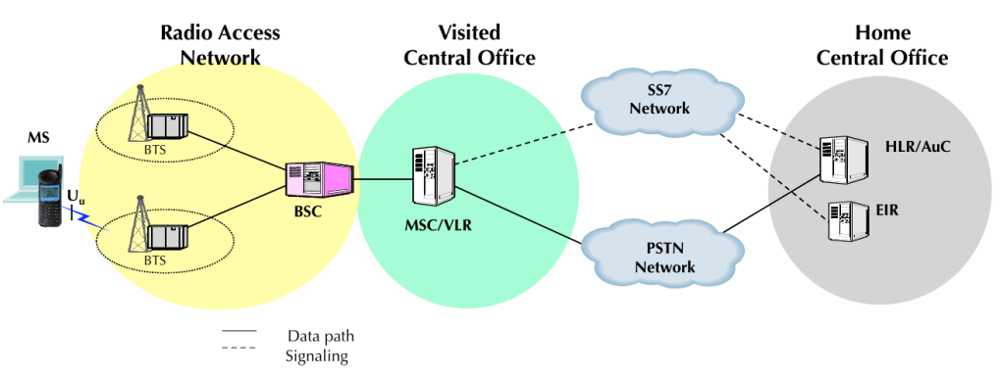
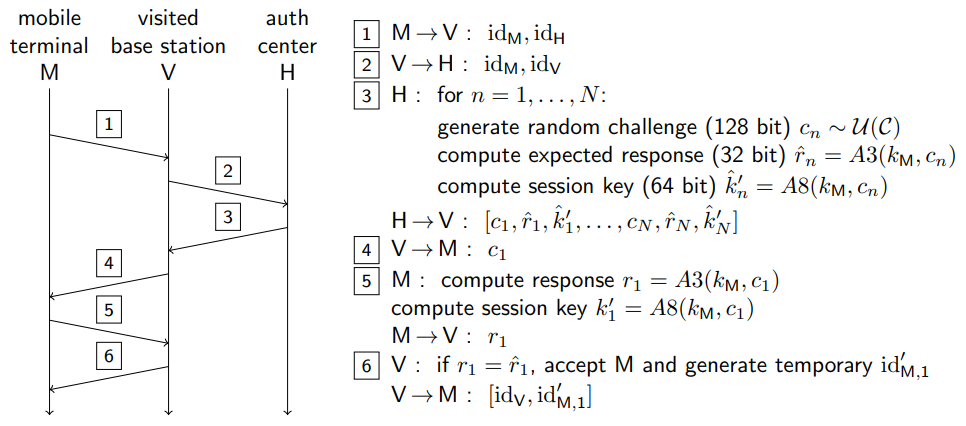
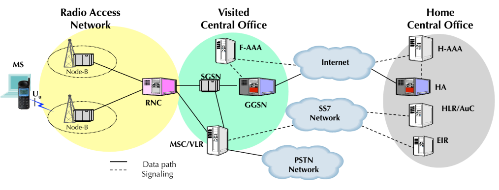
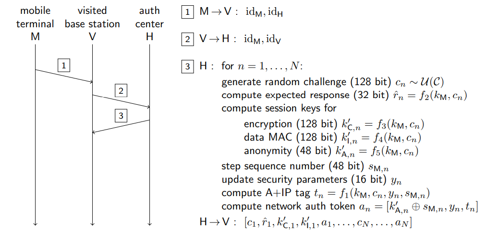
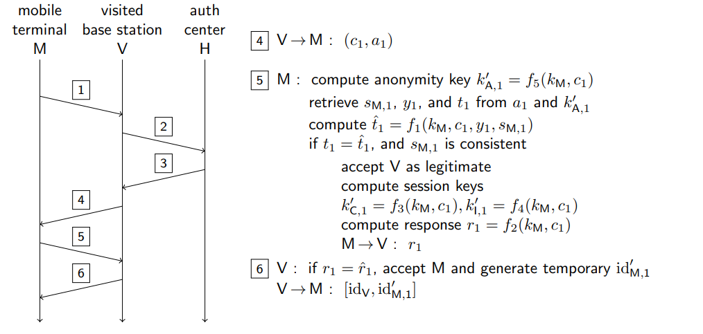
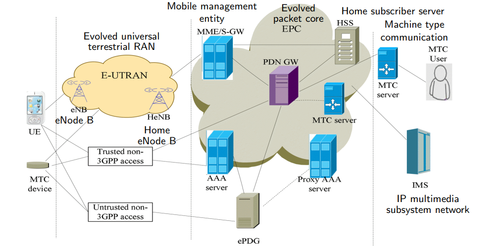
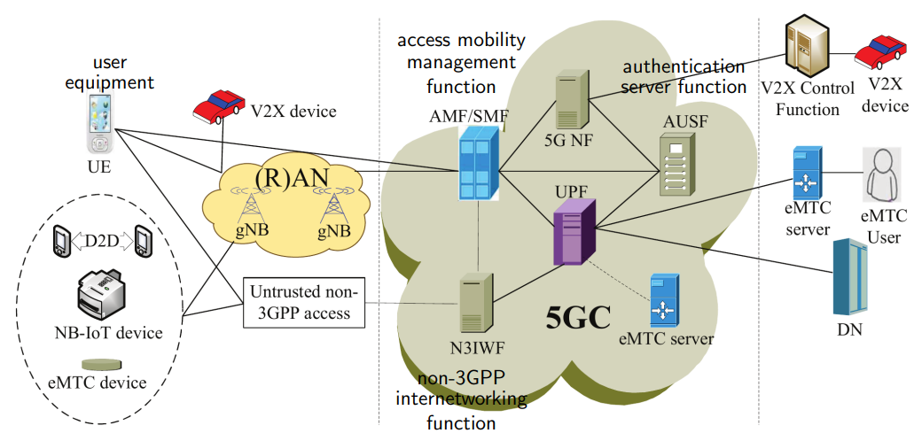

# Answers to the questions of Lecture 22 - Cellular Network Security
## 1. (2G) Cellular Networks: GSM

GSM was designed to provide the following security services:
- `User Privacy` against location tracking
- `Access control` to prevent unauthorized use of the network
- `User authentication` against billing frauds
- `User data secrecy` against eavesdropping

No `data integrity` service was provided.

The Long term credential for a user A were stored in the SIM card. And were the pair:
- IMSI: International Mobile Subscriber Identity $\text{id}_A$
- $k_A$: Master key.

GSM authentication protocol:

The authorization vulnerabilities are:
- No authentication of V to M
- Leaks about $k_M$
  
GSM encryption is based on the A5/1 stream cipher. 

The cryptografic vulnerabilities are:
- The key is only 64 bits long.
- Long time with the same BSC, states will concentrate.
- State update in A5/1 is not one to one.

## 2. (3G) Cellular Networks: UMTS

In addition to the security services provided by GSM, UMTS provides:
- `Mutual authentication` between the user and the network
- `User data integrity` against modification
- `key management` with epheral keys
- `stronger encryption`

The long term credential for a user A are stored in the USIM card and in the authentication center (AuC). And are the pair:
- IMSI: International Mobile Subscriber Identity $\text{id}_A$
- $k_A$: Master key.

UMTS authentication protocol:

The cryptografic mechanisms used are the KDF (Key Derivation Function) and the MAC (Message Authentication Code).

## 3. (4G) Cellular Networks: LTE

LTE has been designed to provide the following security services (in addition to the ones provided by UMTS):
- New Authentication and Key Agreement (AKA) protocol
- New key hierarchy
- New handover key management

`Security domains`

- Network Access Security (NAS): between the UE and the EPC
- User domain: between the UE and the USIM
- Network domain: protection on wired links
- Application domain: protection of application data
- non 3GPP domain: protection of data between the UE and non 3GPP radio networks

## 4. (5G) Cellular Networks

The 5G Authentication and Key Agreement (AKA) protocol enhances the security of the 4G AKA protocol by:
- Assuring the home network that the user is authenticated
- Avoid forged roaming costs

`Security domains`

- Network access protection 
- User domain
- Network domain
- Application domain
- Service baed domain protection of service based interfaces
- Visibility and configurability of security

## [Go back to the main page](../Possible_Questions.md)