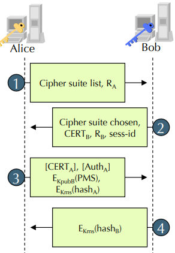

# Answers to the questions of Lecture 23 - TLS
## 1. What is TLS?
TLS is a protocol that provides a secure channel communication between two parties. It is used to secure HTTP, FTP, SMTP, etc. It provides the following security services:
- Confidentiality
- Integrity protection
- Authentication

TLS’ goal is to provide a secure, authenticated channel based on ephemeral keys derived from longer cryptographic credentials (e.g. Kerberos protocol).

## 2. TLS Handshake Protocol and Record Protocol.

The TLS Handshake Protocol is responsible for the authentication and key exchange necessary to establish or resume secure sessions. The handshake protocol is used to negotiate the security parameters, authenticate the server and the client, and establish cryptographic keys shared between the server and the client.

After the handshake protocol is completed, the client and the server can exchange application data. 

TLS Record protocol, once a TLS connection is active, cryptographically protects all user data and all subsequent TLS messages. The record Protocol carries individual messagges and it's protected under symmetric keys.

## [Go back to the main page](../Possible_Questions.md)