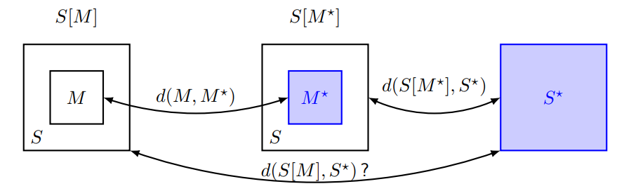

# Answers to the questions of Lecture 24 - Misc
Some questions coming from old oral exams.

## 1.1 What is the composition theorem? What is the asymptoptic version of the composition theorem?
If a mechnism M is $(\varepsilon_1)$-unconditionally secure and S[$M^*$] is $(\varepsilon_2)$-unconditionally secure, then S[M] is $(\varepsilon_1 + \varepsilon_2)$-unconditionally secure.

<mark>Proof.</mark>

By the triangual inequality:

$$
\begin{align*}
d(S[M],S^*)&\leq d(S[M],S[M^*]) + d(S[M^*],S^*)\\
&\leq d(M,M^*) + d(S[M^*],S^*)\\
&\leq \varepsilon_1 + \varepsilon_2
\end{align*}
$$

For the prrof, always remember the schema:

Same thing for the computational formulation, then same thing for the asymptoptic version. Just change and remember the definitions given in [Lecture 3](../Lecture_03/Lecture_03.md).

`Personal Opinion`

For a complete answer, I would also add the following:
- Little step back for the definition of a distinguisher and the definition of the distance between two distributions.
- compare the definition of a mechanism which is $\varepsilon$-unconditionally secure against a class of attacks and $\varepsilon$-unconditionally secure. Why the theorem is true only for the second one?

## 1.2 What is the key secrecy rate?
Given a source $p_{xyz}$, $R_k$ is an `achievable key secrecy rate` if exists a key space K and two functions $f_A,f_B$ such that:
- $|K| \geq 2^{nR_k}$
- $\lim_n P[k_A\neq k_B] = 0$
- $\lim_n I(k_A,k_B;X,Y,Z) = 0$
- $\lim_n nR_K-H(K_A)=0$

## 1.3 Describe the schema of the protocol in 2G mobile. Which are possible limitations?

## 2.1 What is the best layer to apply a secret?
Physical layer. Why? Because the definition of protection at layer N is a set of mechanisms that offer a set of services to protect against a set of attacks at layer N and above, so if you protect the layer at the bottom you are protecting all the layers above.

## 2.2 What is public key encryption? Which are the requirements for public key encryption?
Public key encryption is also called `Asymetric key encryption` and it is used in a system defined as:
$$
S = (\mathcal{K}, \mathcal{K'},\mathcal{U},\mathcal{X}, p_u, p_x, p_k, p_{k'}, E, D)
$$

Basically it differs from the symmetric key encryption because the key is not shared between the two parties, but each party has his own pair of keys, public and private, with wich the cipher and decipher the plain/cipher text. Secrecy came from the fact that the private key is not shared and the encryption/decryption is based on NP-hard problems for examples such as factorization or discrete logarithm.

## 2.3 What is universal hashing? what is a hashing function? What is its purpose?

## 2.4 Describe TLS handshake protocol.

## 3.1 Differences between Digital Signature and MAC. Services provided. Which are the differences between source authentication? What are the differences between message source and identity source authentication?

## 3.2 Definition of perfect secrecy. What is a wiretap channel? How we can order the different channels?

## 3.3 McEliece cryptosystem. Elgamal cryptosystem. Is Elgamal probabilistic? 

## 4.1 What is secrecy key rate?
See above.

## 4.2 What are memory less channels? Talk about secret key capacity.

## 4.3 What do we require in an authentication protocol? Examples.

## 4.4 Integrity protection. What are the requirements for symmetric encryption? In digital Signature using RSA how to generate the keys? What is needed for public and private keys? How to verify the message? Existential forgery? 

## [Go back to the main page](../Possible_Questions.md)